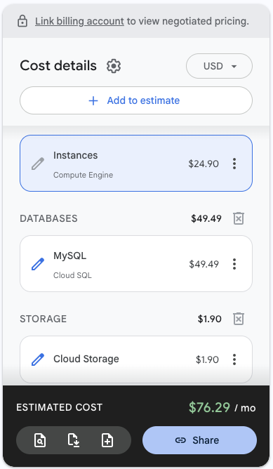

# Introduction
This is a simple gallery web application that is using the following technologies:
- Python Flask App
- GCP hosting
- Terraform

Demo Video: (https://youtu.be/Oz6Onp7DIB0)

This application utilizes terraform for the GCP initilization and tear down. A Cloud SQL database instance is used to store user and photo information. A bucket is used to store the pictures for the web application allowing them to be retrieved, downloaded, or deleted.

All terraform files can be found here on the github. These files include:
- **app-deploy.tf** : configures the vm instance on gcp for the application along with application source files (flask app)
- **bucket.tf** : confirgures and creates the bucket used to store and retrieve images for the web app
- **database.tf** : configures the Cloud SQL instance that the flask app utilizes and connects the db instance to the vm instance via a vpc
- **network.tf** : configures the vpc_network, subnet, and private_vpc_connection for the database instance. also configures the firewall rules to allow traffic on ports 22, 80, and 443
- **output.tf** : displays useful information for production and development including the databaes connection url, bucket url, and VM public IP
- **provider.tf** : configures the provider along with the associated GCP project and service account (utilizes terraform json key)
- **requirments.tf** : specifies the versions for terraform and other associated systems
- **variables.tf** : specifies env variables used by the terraform files such as projectid, region, and zone

# Set-up
NOTE: if you simply pull this repo and try to run the application it will not work, env variables are hidden to limit access to the assoicated GCP project
```
cd gallery
./creation_script.sh
```
you could also run the script with these options to have the vm pull the source code from a specified repo
```
cd gallery
./creation_script.sh --from-git <REPO-URL>
```
This shell script creates a tar.gz file for the source code of the project which terraform then utilizes on the VM instance it creates
```
cd ..
terraform init
terraform apply
```
This will create the vm instance as well as configure run a script on the vm to host the flask app, terraform apply will output the public ip of the vm instance which you can then navigate to. Note: the flask app takes a minute or so to launch on the created vm and wont be available instantly after running terraform apply.

The output from running terraform apply is as follows:
```
Apply complete! Resources: 0 added, 0 changed, 8 destroyed.

Outputs:

bucket_name = "dc635ace-05de-65a5-38b2-fcd15cc876fb"
bucket_url = "gs://dc635ace-05de-65a5-38b2-fcd15cc876fb"
db_connection_name = "proj-459616:us-central1:flask-mysql-db"
vm_ip = "34.41.180.136"
```
Note that the public IP is suseptible to change.

# Architecture Diagram


# Validation
Google Cloud Console Resources


VM Instance


Database Instance


Bucket


Network


# Application Interface


# DB Connection


# Cost Break Down
Using the specified vm instance and db from the project description results in this monthly price, this could be easily reduced with a less powerful vm and db instance



The runtime for this application depends if your building it from scratch. From scratch the database creation takes a long time, resulting in a run time of around 18 minutes.
If your db is already persistent, then the run time is closer to 1 minute.